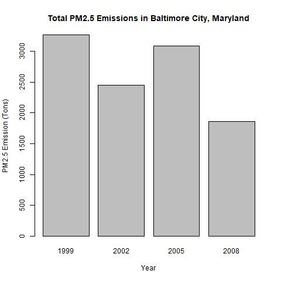

# Exploratory Data Analysis - Project 2

Course project 2 in the Coursera "Data Science Specialization"

Note: The scripts expects that the datafile has been downloaded and extracted in a subdirectory named 'data'. The datafile has not been included here because of the filesize. The download link can be found in the assignment instructions.

## Question 1

Take the sum of the emissions per year by using the aggregate function:

```{r, eval=FALSE}
aggEmissions <- aggregate(Emissions ~ year, NEI, sum)
```

Plotting the total emissions in a barplot and adding annotations:

```{r, eval=FALSE}
with(aggEmissions,
     barplot(Emissions / 10^6,
             names.arg = year,
             xlab = "Year",
             ylab = "PM2.5 Emission (10^6 Tons)",
             main = "Total PM2.5 Emissions From All US Sources")
)
```


The barplot shows that the total PM2.5 emissions have decreased in the US from 1999 to 2008.


## Question 2

Filter the dataset by for Baltimore City, Maryland and take the sum of the emissions per year by using the aggregate function:

```{r, eval=FALSE}
BCM <- filter(NEI, fips == "24510")
aggEmissionsBCM <- aggregate(Emissions ~ year, BCM, sum)
```

Plotting the total emissions in a barplot and adding annotations:

```{r, eval=FALSE}
with(aggEmissionsBCM,
     barplot(Emissions,
             names.arg = year,
             xlab = "Year",
             ylab = "PM2.5 Emission (Tons)",
             main = "Total PM2.5 Emissions in Baltimore City, Maryland")
)
```


The barplot shows that there was a spike in the PM2.5 emissions in 2005, but overall the total PM2.5 emissions have decreased in Baltimore City, Maryland from 1999 to 2008.