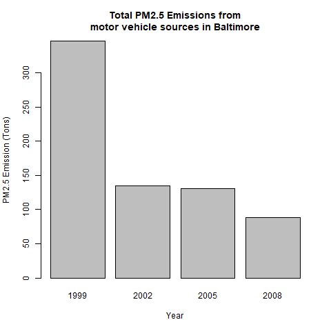
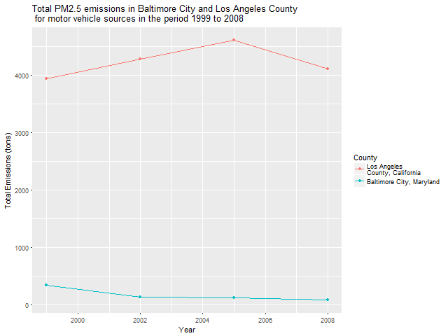

# Exploratory Data Analysis - Project 2

Course project 2 in the Coursera "Data Science Specialization"

Note: The scripts expects that the datafile has been downloaded and extracted in a subdirectory named 'data'. The datafile has not been included here because of the filesize. The download link can be found in the assignment instructions.

## Question 1

Take the sum of the emissions per year by using the aggregate function:

```{r, eval=FALSE}
aggEmissions <- aggregate(Emissions ~ year, NEI, sum)
```

Plotting the total emissions in a barplot and adding annotations:

```{r, eval=FALSE}
with(aggEmissions,
     barplot(Emissions / 10^6,
             names.arg = year,
             xlab = "Year",
             ylab = "PM2.5 Emission (10^6 Tons)",
             main = "Total PM2.5 Emissions From All US Sources")
)
```


The barplot shows that the total PM2.5 emissions have decreased in the US from 1999 to 2008.


## Question 2

Filter the dataset by for Baltimore City, Maryland and take the sum of the emissions per year by using the aggregate function:

```{r, eval=FALSE}
BCM <- filter(NEI, fips == "24510")
aggEmissionsBCM <- aggregate(Emissions ~ year, BCM, sum)
```

Plotting the total emissions in a barplot and adding annotations:

```{r, eval=FALSE}
with(aggEmissionsBCM,
     barplot(Emissions,
             names.arg = year,
             xlab = "Year",
             ylab = "PM2.5 Emission (Tons)",
             main = "Total PM2.5 Emissions in Baltimore City, Maryland")
)
```


The barplot shows that there was a spike in the PM2.5 emissions in 2005, but overall the total PM2.5 emissions have decreased in Baltimore City, Maryland from 1999 to 2008.

## Question 3

Filter the dataset by for Baltimore City, Maryland and take the sum of the emissions grouped by type and year by using the aggregate function:

```{r, eval=FALSE}
BCM <- filter(NEI, fips == "24510")
aggEmissionsBCM <- aggregate(Emissions ~ type + year, BCM, sum)
```

Plotting the total emissions for the four types of PM2.5 usinng ggplot2 and adding annotations:

```{r, eval=FALSE}

plot3 <- ggplot(aggEmissionsBCM, aes(year, Emissions, color = type)) +
        geom_line() +
        xlab("Year") +
        ylab(expression("Total PM"[2.5]* " Emissions (tons)")) +
        ggtitle(expression("Total PM"[2.5]* " Emissions in Baltimore City, Maryland"))

print(plot3)
```


The plot shows that emission types *non-road*, *nonpoint*, and *on-road* have decreased in the period 1999 to 2008, while the *point* emission type has increased in the same time period.

## Question 4

Grab the codes for coal combustion related emissions:

```{r, eval=FALSE}
SCC.codes = SCC[which(grepl("coal", SCC$EI.Sector, ignore.case = TRUE) & 
        grepl("comb", SCC$EI.Sector, ignore.case = TRUE)),]$SCC
```

Filter the dataset using the SCC codes for coal combustion sources:

```{r, eval=FALSE}
NEI.filtered <- filter(NEI, SCC %in% SCC.codes)
```

Take the sum of the emissions per year by using the aggregate function:

```{r, eval=FALSE}
NEI.sum <- aggregate(Emissions ~ year, NEI.filtered, sum)
```

Plot the total emissions in a barplot and adding annotations:

```{r, eval=FALSE}
with(NEI.sum,
     barplot(Emissions,
             names.arg = year,
             xlab = "Year",
             ylab = "PM2.5 Emission (Tons)",
             main = "Total PM2.5 emissions from\n coal combustion-related sources in US")
)
```


The plot shows that the emissions from coal combustion related sources have decreased in the period 1999 to 2008.

## Question 5

Filter the dataset for "on-road" type emission types in Baltimore:

```{r, eval=FALSE}
NEI.filtered <- filter(NEI, fips == "24510" & type == "ON-ROAD")
```

Take the sum of the emissions per year by using the aggregate function:

```{r, eval=FALSE}
NEI.sum <- aggregate(Emissions ~ year, NEI.filtered, sum)
```

Plot the total emissions in a barplot and adding annotations:

```{r, eval=FALSE}
with(NEI.sum,
     barplot(Emissions,
             names.arg = year,
             xlab = "Year",
             ylab = "PM2.5 Emission (Tons)",
             main = "Total PM2.5 Emissions from\nmotor vehicle sources in Baltimore")
)
```


The plot shows that the emissions from motor vehicle sources have decreased in Baltimore in the period 1999 to 2008.

## Question 6

Filter the dataset for "on-road" type emission types in Baltimore or LA:

```{r, eval=FALSE}
NEI.filtered <- filter(NEI, (fips == "24510" | fips == "06037") & type == "ON-ROAD")
```

Take the sum of the emissions grouped by fips and year by using the aggregate function:

```{r, eval=FALSE}
NEI.sum <- aggregate(Emissions ~ year + fips, NEI.filtered, sum)
```

Plot the total emissions using ggplot2 and adding annotations:

```{r, eval=FALSE}
plot5 <- ggplot(data=NEI.sum, aes(x=year, y=Emissions, group=fips, colour=fips)) + 
                geom_line() + 
                geom_point() + 
                xlab("Year") + 
                ylab("Total Emissions (tons)") + 
                ggtitle("Total PM2.5 emissions in Baltimore City and Los Angeles County\n for motor vehicle sources in the period 1999 to 2008") + 
                scale_colour_discrete(name="County", 
                labels=c("Los Angeles \nCounty, California", "Baltimore City, Maryland"))

print(plot5)
```


The plot shows that the emissions from motor vehicle sources have decreased in Baltimore and increased in LA in the period 1999 to 2008. The relative change is greatest in Baltimore City.